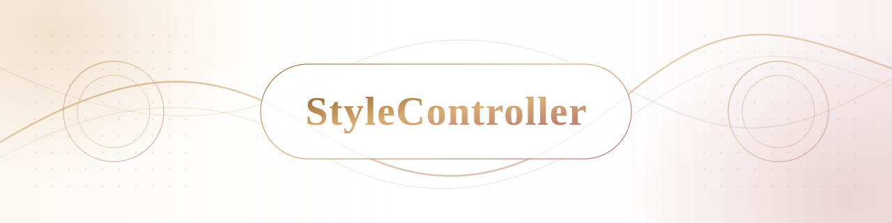
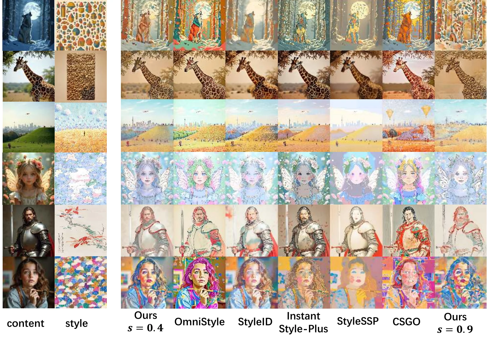
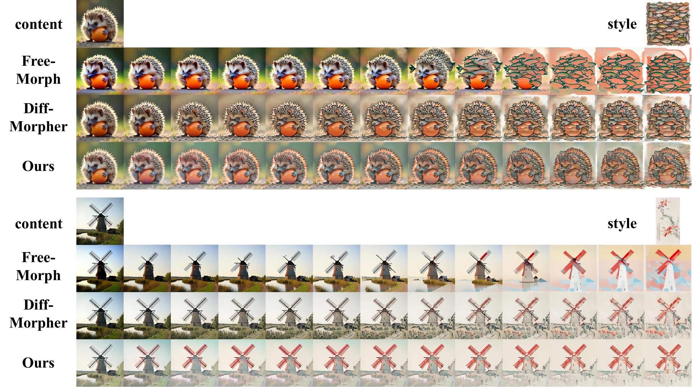

<p align="center">
  
</p>

<!-- <h1 align="center">StyleController</h1> -->

<h3 align="center">
  Staying True to the Origin: Continuous Image Stylization with Smooth Transitions
</h3>

<p align="center">
  Rui Xu &nbsp;·&nbsp; Hanmo Zhang &nbsp;·&nbsp; Songhua Liu<br>
  Shanghai Jiao Tong University
</p>

<p align="center">
  <a href="https://huggingface.co/datasets/ReyChiaro/SmoothStyle"></a>
  <a href="https://huggingface.co/ReyChiaro/StyleController"></a>
  <a href="https://reychiaro.github.io/StyleController/"></a>
  <a href=""></a>
  <a href="https://github.com/ReyChiaro/StyleController"></a>
</p>

StyleController is a controllable image stylization framework built on `diffusers`. Given a content image, a style reference, and a text instruction, it generates high-fidelity stylized images with explicit control over style strength.

The method first learns a strong stylization endpoint with LoRA, then trains lightweight projectors at discrete strength anchors. Strength-aware interpolation in the low-rank parameter space produces smooth, continuous transitions while preserving content structure and local style patterns.

## Highlights

- **High-fidelity stylization:** preserves content semantics while transferring global colors and fine-grained style patterns.
- **Explicit strength control:** maps a scalar strength to lightweight projectors in the LoRA parameter space.
- **Smooth transitions:** generates continuous stylization paths from a small set of discrete training anchors.
- **Multiple backbones:** supports both Qwen-Image-Edit and FLUX.1-Kontext.

## Results

### Stylization Quality

<p align="center">
  
</p>

StyleController preserves content layouts under both moderate and strong stylization while progressively introducing the reference style's colors, textures, and local patterns.

### Smooth Transition Paths

<p align="center">
  
</p>

Unlike image morphing methods that require a ground-truth stylized endpoint, StyleController directly generates a stable, continuous stylization trajectory from the content and style references.

## Quick Start

### Environment

StyleController requires Python 3.12 or later and an NVIDIA GPU for training and CUDA inference. Install the environment with [uv](https://docs.astral.sh/uv/):

```bash
uv sync
```

The default backbones are downloaded from Hugging Face when first used. Make sure your account has access to the selected backbone, or pass a local path with `--pretrained-pipeline`.

### Inference

The following example runs Qwen-based stylization at strength `0.55` using a base LoRA and projector anchors:

```bash
uv run python infer_styctrl.py \
  --model qwen \
  --content examples/content.jpg \
  --style examples/style.jpg \
  --prompt "Transfer the style of image 2 to image 1 while preserving the content structure." \
  --strength 0.55 \
  --output outputs/result_055.png \
  --lora-checkpoint /path/to/base_lora.safetensors \
  --projector-checkpoints \
    /path/to/projector_s00.safetensors \
    /path/to/projector_s01.safetensors \
    /path/to/projector_s02.safetensors \
    /path/to/projector_s03.safetensors \
    /path/to/projector_s04.safetensors \
    /path/to/projector_s05.safetensors \
    /path/to/projector_s06.safetensors \
    /path/to/projector_s07.safetensors \
    /path/to/projector_s08.safetensors \
    /path/to/projector_s09.safetensors \
  --anchor-strengths 0.0 0.1 0.2 0.3 0.4 0.5 0.6 0.7 0.8 0.9
```

Use `--model flux` for FLUX.1-Kontext checkpoints. The checkpoint rank and layer range must match the settings used during training.

### SmoothStyle Dataset

SmoothStyle has been released on Hugging Face. Download it into the repository as `SmoothStyle`:

```bash
git clone <HUGGING_FACE_DATASET_URL> SmoothStyle
```

The training scripts expect the following structure:

```text
SmoothStyle/
└── data/
    ├── train/
    │   ├── metadata.jsonl
    │   ├── content/
    │   ├── style/
    │   └── target/s01 ... target/s10/
    └── test/
        └── ...
```

Each metadata row identifies a content image, style image, stylized target, pair ID, strength ID, and normalized strength. A zero-strength target is constructed from the original content image when training the `s0` projector.

### Training

Train the base LoRA on the strongest stylization endpoint:

```bash
uv run python train_lora.py \
  --model qwen \
  --dataset-dir SmoothStyle \
  --project-name stylecontroller_lora_s10 \
  --gpu 0
```

Then freeze the base LoRA and train the default `s0`-`s9` projector anchors across the available GPUs:

```bash
uv run python train_projectors.py \
  --model qwen \
  --dataset-dir SmoothStyle \
  --lora-checkpoint /path/to/styctrl_lora_styctrl.safetensors \
  --gpus 0 1 2 3 \
  --project-name-prefix stylecontroller_projector
```

Training outputs are written to `experiment/outputs/<project-name>/<timestamp>/`.

## Citation

<!-- Citation will be added after the paper is released. -->

## License

This project is released under the [MIT License](LICENSE).
